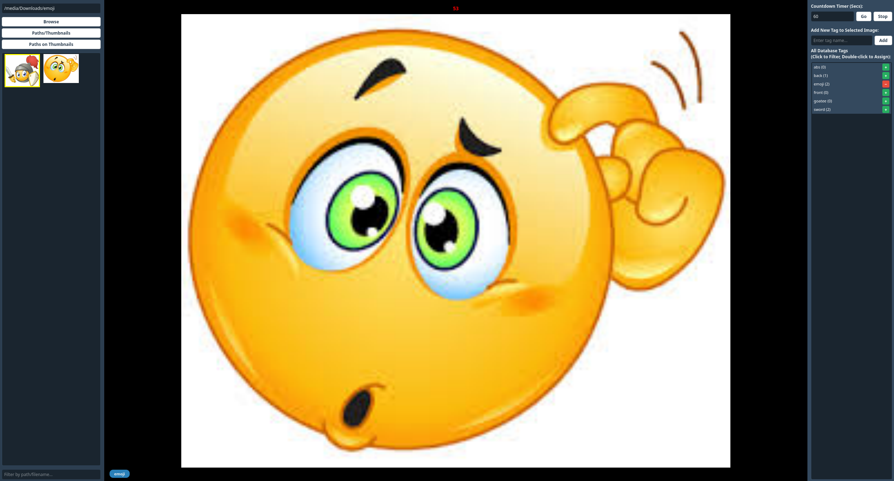

# ⚠️ MASSIVE WARNING ⚠️
**READ THIS BEFORE USING OR EXPECTING ANYTHING FROM THIS SOFTWARE:**

1. **This project is 100% vibe coded.** The architecture was manifested into existence.
2. **It is only tested on Linux on a single machine configuration.** It should theoretically work on Windows and macOS now due to cross-platform paths, but I make absolutely zero promises. 
3. **I will barely update this.** Do not expect active maintenance, feature requests, or bug fixes. Fork it if you want to change it.

---

# RefViewer



RefViewer is a fast (questionable, this is vibe coded after all), local desktop image viewer and reference gallery tool built with PyQt6 and SQLite. It is designed to help artists, designers, or anyone who needs to seamlessly organize, tag, and view reference images across their filesystem.

## Features

- **Global Tagging System:** Quickly add, remove, and manage tags using quick-toggle `+`/`-` buttons. Tags persist in an SQLite database and are linked to absolute file paths.
- **Cross-Folder Filtering:** Click a tag to instantly see all images associated with that tag, even if they live outside your currently selected folder (outlined in yellow).
- **Multi-Select Bulk Tagging:** Shift/Ctrl+Click to select many images and tag them in one go. The `+`/`-` state shows a tag as assigned only when *every* selected image has it.
- **Session History Tab:** The left sidebar is tabbed into "Images" and "History." Every image you actively view (by clicking it in Images, or via the Random-image shortcut) gets added to History as a thumbnail, most-recent first. It's purely in-memory/ephemeral — clicking around inside History itself doesn't add more entries, and the whole list clears automatically when you close the app (or manually via the "Clear History" button). History keeps the **100** most recent images; older entries are dropped as new ones arrive.
- **Blazing Fast, Uncapped Rendering:** Multi-threaded background thumbnail generation. Image decoding allocation limits are completely disabled to support massive, high-res canvas files without crashing.
- **EXIF Aware:** Automatically reads EXIF metadata to ensure phone/camera photos aren't rotated sideways.
- **Pen Annotations:** Draw directly on top of the currently viewed image with a configurable pen color (including alpha/opacity) and size — great for pointing out proportions, lighting notes, or gesture lines. Quick-access swatches (Red, Blue, Yellow, Green, Magenta, Orange, Cyan) and size presets (1/2/5/10/20) sit on the toolbar for one-click switching, and the swatches preview whatever opacity you currently have set. Fully non-destructive: annotations are never saved to the image file or database, and are automatically cleared the moment you switch images or close the app. Supports Undo/Redo (`Ctrl+Z` / `Ctrl+Shift+Z`), up to **500** retained strokes — past that the oldest stroke is dropped. Clearing annotations (`Delete` or the 🧹 button) also wipes the undo/redo history, so a clear cannot be undone. Both the toolbar and filepath label hide automatically in fullscreen focus mode (`F`).
- **Filepath Display:** The full path of the currently viewed image is shown above the tag chips, and the text is selectable for easy copying.
- **Speed Drawing Timer:** A configurable countdown timer that loops and randomly selects a *new* image when it hits zero—perfect for gesture drawing or art practice. It auto-pauses while you have multiple images selected, so bulk tagging doesn't get interrupted.
- **Hot-Reloading:** Built-in `watchfiles` support for instant UI restarts on file save during development.

## Shortcuts

* F to toggle sidebars
* Space to toggle timer start and stop. Defaults to 60 seconds if you haven't set a value yet.
* R to randomly select another image
* Ctrl+D to toggle the pen annotation tool on/off
* Ctrl+Z / Ctrl+Shift+Z to undo/redo pen annotations (ignored while typing in a text field)
* Delete to clear all pen annotations and their undo history (ignored while typing in a text field)

## Setup & Development (Using `uv` & `mise`)

This project uses modern Python tooling. You will need [uv](https://github.com/astral-sh/uv) and [mise](https://github.com/jdx/mise) installed on your system.

1. Clone or download this repository.

2. **Activate mise in your shell.** You must hook mise into your shell so it can dynamically swap tool versions when you change directories. Add the appropriate line to your shell configuration file:

   ```bash
   # For Zsh
   echo 'eval "$(mise activate zsh)"' >> ~/.zshrc

   # For Bash
   echo 'eval "$(mise activate bash)"' >> ~/.bashrc
   ```

3. **Provision the toolchain.** From the project directory:

   ```bash
   mise trust    # Trust the local configuration file
   mise install  # Install Python, uv, and anything else in mise.toml
   ```

4. **Install dependencies.** This creates `.venv` automatically using the mise-managed Python:

   ```bash
   uv sync
   ```

5. **Run it:**

   ```bash
   mise run dev
   ```

### Available tasks

Run `mise tasks` to see everything. The useful ones:

| Task | What it does |
| --- | --- |
| `mise run dev` | Start the app |
| `mise run watch` | Start with hot-reload on file save |
| `mise run build` | Build a windowed binary into `dist/` |
| `mise run build:one` | Build a single-file binary |
| `mise run build:plat:linux` | Build the Linux binary + MD5 checksum |
| `mise run build:plat:mac` | Build the macOS binary + MD5 checksum |
| `mise run build:plat:win` | Build the Windows `.exe` + MD5 checksum |
| `mise run clean` | Wipe build artifacts, caches, and `.venv` |

### Where is my data saved?

RefViewer checks your operating system and stores its database and thumbnail cache in the native app-data directories:

| | Database | Thumbnail cache |
| --- | --- | --- |
| **Linux** | `~/.config/refviewer/data.db` | `~/.cache/refviewer/thumbnails/` |
| **macOS** | `~/Library/Application Support/refviewer/data.db` | `~/Library/Caches/refviewer/thumbnails/` |
| **Windows** | `%APPDATA%\refviewer\data.db` | `%LOCALAPPDATA%\refviewer\thumbnails\` |

On Linux the `XDG_CONFIG_HOME` and `XDG_CACHE_HOME` environment variables are respected if set.

To clear out old sideways images or broken thumbnails, just delete the thumbnail cache folder — it regenerates on demand. Deleting `data.db` throws away all your tags.

## Project Structure

    refviewer/
    ┣ components/
    ┃ ┣ __init__.py
    ┃ ┣ image_viewer.py        # CanvasLoader: background full-res decoding
    ┃ ┣ drawing_canvas.py      # Annotation canvas + pen toolbar
    ┃ ┗ thumbnail_loader.py    # Multi-threaded concurrent cache generation
    ┣ config.py                # UI styling, tunable constants, cross-platform paths
    ┣ database.py              # SQLite3 data management & tag schema
    ┣ file_scanner.py          # OS walking and file discovery
    ┣ main_window.py           # Core GUI layouts, signals, and routing
    ┣ main.py                  # Standard app entry point
    ┗ mise.toml                # Task runner commands (npm run style)

`ARCHITECTURE.md` has a much deeper walkthrough of the Qt patterns, database schema, and threading model — but note it predates the History tab and the annotation tool, so it doesn't cover those.

# License

Do whatever you want with this codebase.
